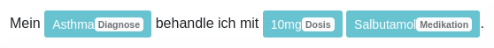

# GPTNERMED

## About
GPTNERMED is a novel open synthesized dataset and neural named-entity-recognition (NER) model for German texts in medical natural language processing (NLP).

Key features:
 - Supported labels: *Medikation*, *Dosis*, *Diagnose*
 - Open silver-standard German medical dataset: **245107 tokens** with annotations for Dosis (**#7547**), Medikation (**#9868**) and Diagnose (**#5996**)
 - Synthesized dataset based on [**GPT NeoX**](https://github.com/EleutherAI/gpt-neox)
 - **Transfer-learning** for NER parsing using **gbert-large**, **GottBERT-base** or **German-MedBERT**
 - **Open, public access** to models

**Online Demo**: A demo page is available: [Demo](https://gptnermed.misit-augsburg.de/), or use the HuggingFace links given below.

See our **[published paper](https://doi.org/10.1016/j.jbi.2023.104478)** at [https://doi.org/10.1016/j.jbi.2023.104478](https://doi.org/10.1016/j.jbi.2023.104478).

Our [pre-print paper](https://arxiv.org/pdf/2208.14493.pdf) is available at [https://arxiv.org/pdf/2208.14493.pdf](https://arxiv.org/pdf/2208.14493.pdf).

NER demonstration:  
<kbd></kbd>

## Models
The pretrained models can be retrieved from the following URLs:
- gbert-based: [model link](https://myweb.rz.uni-augsburg.de/~freijoha/GPTNERMED/GPTNERMED_gbert.zip)
- GottBERT-based: [model link](https://myweb.rz.uni-augsburg.de/~freijoha/GPTNERMED/GPTNERMED_GottBERT.zip)
- German-MedBERT-based: [model link](https://myweb.rz.uni-augsburg.de/~freijoha/GPTNERMED/GPTNERMED_GermanMedBERT.zip)

The models are also available on the **HuggingFace** platform:
- gbert-based: [HuggingFace link](https://huggingface.co/jfrei/de_GPTNERMED_gbert)
- GottBERT-based: [HuggingFace link](https://huggingface.co/jfrei/de_GPTNERMED_GottBERT)
- German MedBERT-based: [HuggingFace link](https://huggingface.co/jfrei/de_GPTNERMED_GermanMedBERT)

**HuggingFace Dataset:** The dataset is also available as a [HuggingFace Dataset](https://huggingface.co/datasets/jfrei/GPTNERMED).\
You can load the model as follows:
```python
# You need to install datasets first, using: pip install datasets
from datasets import load_dataset
dataset = load_dataset("jfrei/GPTNERMED")
```

## Scores
Note: Metric scores are evaluated by character-wise classification.

**Out of Distribution Dataset** (provided in `OoD-dataset_GoldStandard.jsonl`):  
| **Model**          | Metric | **Drug = Medikation** |
|--------------------|--------|-----------------------|
| **gbert-large**    | Pr     | 0.707                 |
|                    | Re     | **0.979**             |
|                    | F1     | 0.821                 |
| **GottBERT-base**  | Pr     | **0.800**             |
|                    | Re     | 0.899                 |
|                    | F1     | **0.847**             |
| **German-MedBERT** | Pr     | 0.727                 |
|                    | Re     | 0.818                 |
|                    | F1     | 0.770                 |

**Test Set**:  
| **Model**          | Metric | **Medikation** | **Diagnose** | **Dosis** | **Total** |
|--------------------|--------|----------------|--------------|-----------|-----------|
| **gbert-large**    | Pr     | 0.870          | 0.870        | 0.883     | 0.918     |
|                    | Re     | **0.936**      | **0.895**    | **0.921** | **0.919** |
|                    | F1     | **0.949**      | **0.882**    | **0.901** | **0.918** |
| **GottBERT-base**  | Pr     | 0.979          | 0.896        | **0.887** | **0.936** |
|                    | Re     | 0.910          | 0.844        | 0.907     | 0.886     |
|                    | F1     | 0.943          | 0.870        | 0.897     | 0.910     |
| **German-MedBERT** | Pr     | **0.980**      | **0.910**    | 0.829     | 0.932     |
|                    | Re     | 0.905          | 0.730        | 0.890     | 0.842     |
|                    | F1     | 0.941          | 0.810        | 0.858     | 0.883     |

## Setup and Usage
The models are based on SpaCy. The sample code is written in Python.

```bash
model_link="https://myweb.rz.uni-augsburg.de/~freijoha/GPTNERMED/GPTNERMED_gbert.zip"

# [Optional] Create env
python3 -m venv env
source ./env/bin/activate

# Install dependencies
python3 -m pip install -r requirements.txt

# Download & extract model
wget -O model.zip "$model_link"
unzip model.zip -d "model"

# Run script
python3 GPTNERMED.py
```

## Citation
Cite our work with BibTex as written below or use the citation tools from the [paper](https://doi.org/10.1016/j.jbi.2023.104478).
```
@article{FREI2023104478,
title = {Annotated dataset creation through large language models for non-english medical NLP},
journal = {Journal of Biomedical Informatics},
volume = {145},
pages = {104478},
year = {2023},
issn = {1532-0464},
doi = {https://doi.org/10.1016/j.jbi.2023.104478},
url = {https://www.sciencedirect.com/science/article/pii/S1532046423001995},
author = {Johann Frei and Frank Kramer},
keywords = {Natural language processing, Information extraction, Named entity recognition, Data augmentation, Knowledge distillation, Medication detection},
abstract = {Obtaining text datasets with semantic annotations is an effortful process, yet crucial for supervised training in natural language processing (NLP). In general, developing and applying new NLP pipelines in domain-specific contexts for tasks often requires custom-designed datasets to address NLP tasks in a supervised machine learning fashion. When operating in non-English languages for medical data processing, this exposes several minor and major, interconnected problems such as the lack of task-matching datasets as well as task-specific pre-trained models. In our work, we suggest to leverage pre-trained large language models for training data acquisition in order to retrieve sufficiently large datasets for training smaller and more efficient models for use-case-specific tasks. To demonstrate the effectiveness of your approach, we create a custom dataset that we use to train a medical NER model for German texts, GPTNERMED, yet our method remains language-independent in principle. Our obtained dataset as well as our pre-trained models are publicly available at https://github.com/frankkramer-lab/GPTNERMED.}
}
```
